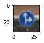
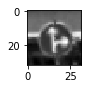
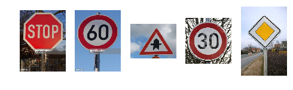

#**Traffic Sign Recognition**


**Build a Traffic Sign Recognition Project**

The goals / steps of this project are the following:
* Load the data set
* Explore, summarize and visualize the data set
* Design, train and test a model architecture
* Use the model to make predictions on new images
* Analyze the softmax probabilities of the new images


---


###Data Set Summary & Exploration
####1. Basic summary of the data set


I used the numpy library to calculate summary statistics of the traffic
signs data set:

* The size of training set is 34799.
* The size of the validation set is 4410.
* The size of test set is 12630
* The shape of a traffic sign image is (32, 32, 3).
* The number of unique classes/labels in the data set is 43.

####2. Include an exploratory visualization of the dataset.

Here is an exploratory visualization of the data set. It is a histogram showing how many examples for each label we have in the training data.


Additionally, here is an example of 32 by 32 image from the training data.




###Design and Test a Model Architecture
####1. Preprocessing the data

As a first step, I decided to convert the images to grayscale because the shapes of and on the sign are more important than the  colors. Moreover, it reduces the size of the training data and makes training faster.  

```python
np.sum(X_train/3, axis=3, keepdims=True)
```

Here is an example of a traffic sign image before and after grayscaling.





As a last step, I normalized the image data to have zero mean and standard deviation 1 because it increases the validation accuracy in each epoch.

```python
def normalized(XX):
    for i in range(len(XX)):
        aa = XX[i]
        XX[i] = (XX[i] - np.mean(aa))/np.std(aa)
    return XX
```

I generated additional data for labels with a small number of examples by translating and scaling images with these labels. But just improving  LeNet gives better results. So this is not included in the final submission.


####2. Final model architecture

My final model is the neural network LeNet with an additional dropout and consists of the following layers:

| Layer         		|     Description	        					|
|:---------------------:|:---------------------------------------------:|
| Input         		| 32x32x1 grayscale image   							|
| Convolution 5x5     	| 1x1 stride, valid padding, outputs 28x28x6 	|
| RELU					|												|
| Max pooling	      	| 2x2 stride,  outputs 14x14x6 				|
| Convolution 5x5	    |  1x1 stride, valid padding, outputs  10x10x16    									|
| RELU					|												|
| Max pooling	      	| 2x2 stride,  outputs 5x5x6 				|
| Flatten		|         									|
| Dropout		|         									|
| Fully connected		| Input = 400. Output = 120      									|
| Fully connected		| Input = 120. Output = 84     									|
| Fully connected		| Input = 84 Output = 43      									|


####3. Training the model

To train the model, I used an AdamOptimizer,  batch size of 128, number of epochs of 18, a keep probability of 0.6 and a learning rate of 0.001.

####4. Final solution and accuracy

My final model results were:
* training set accuracy of 0.999
* validation set accuracy of 0.963
* test set accuracy of 0.937

I started with the original LeNet architecture that works well on the MNIST data set. Since LeNet works well for the MNIST data set, I thought it will have good chances for the gray scaled traffic sign data. I changed the number of output classes in the last layer from 10 to 43 to account for the increased number of labels.

In order to improve accuracy on the validation set, I added a dropout layer before the first fully connected layer.

A validation set accuracy of 0.963 and test set accuracy of 0.937 are excellent evidence that this modified LeNet works well for traffic signs.


###Test the Model on New Images

####1. Applying the model to  five German traffic signs found on the web

Here are five German traffic signs that I found on the web:



I cut them in squares by hand and then rescaled them to be 32 by 32.


####2. Model predictions on these new traffic signs

Here are the results of the prediction:

| Image			        |     Prediction	        					|
|:---------------------:|:---------------------------------------------:|
| Stop Sign      		| Stop sign   									|
| 60 km/h    			| 60 km/h 										|
| Right-of-way at the next intersection					| Right-of-way at the next intersection											|
| 30 km/h	      		| 30 km/h					 				|
| Priority Road			| Priority Road      							|


The model was able to correctly classify 5 of the 5 traffic signs, which gives an accuracy of 100%. This speak for the model.

####3. Top 5 softmax probabilities

The top five soft max probabilities were

| Probability         	|     Prediction	        					|
|:---------------------:|:---------------------------------------------:|
| 0.996      		| Stop sign   									|
| 1.   			| 60 km/h 										|
| 0.968					| Right-of-way at the next intersection											|
| 1.	      		| 30 km/h					 				|
| 0.995		| Priority Road      							|
